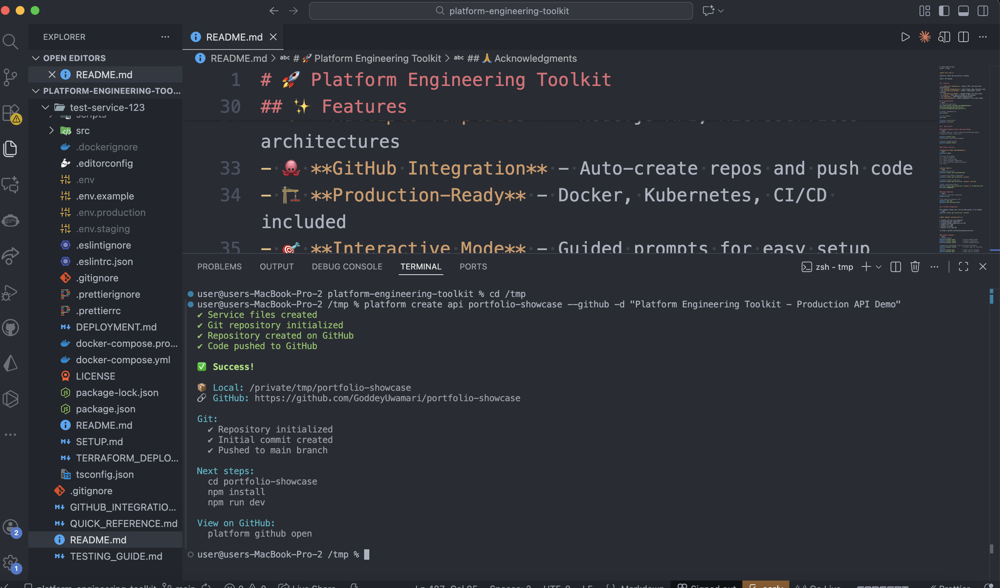
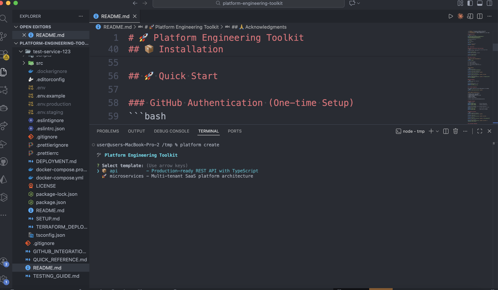
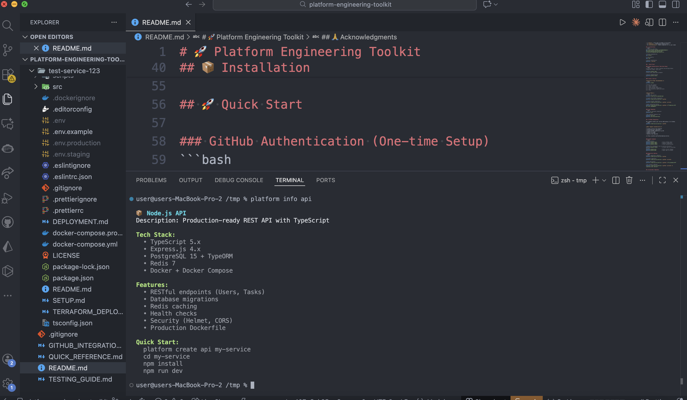
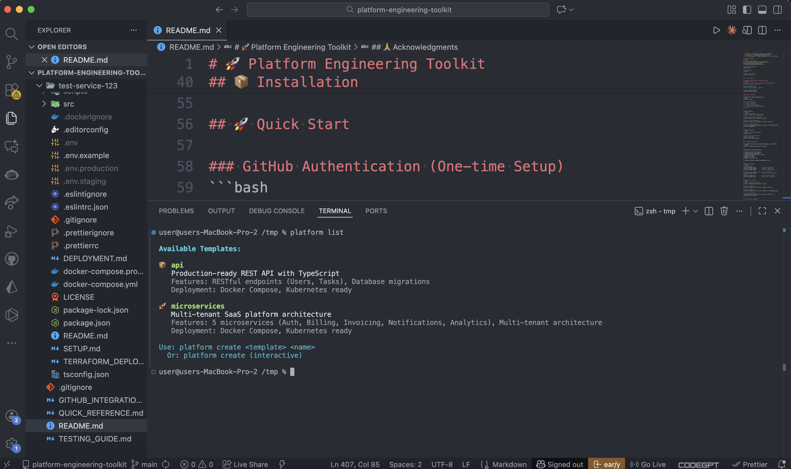

# 🚀 Platform Engineering Toolkit


> Self-service platform for creating production-ready services with GitHub integration - from template to live repo in 30 seconds

## 🎯 What is This?

A CLI tool that automates the entire service creation workflow - from selecting a template to having your code live on GitHub. One command creates a production-ready service, initializes git, creates a GitHub repository, and pushes your code.

**Before this tool:**
```
1. Copy template (15 min)
2. Configure project (30 min)
3. Initialize git (5 min)
4. Create GitHub repo (5 min)
5. Push code (5 min)
Total: ~1 hour
```

**With this tool:**
```
platform create api my-service --github

Total: 30 seconds
```

## 📸 See It In Action

### GitHub Integration - One Command, Complete Automation


### Interactive Mode - Guided Setup


### Template Information


### Available Templates


---

## ✨ Features

- 🎨 **Multiple Templates** - Node.js API, Microservices architectures
- 🐙 **GitHub Integration** - Auto-create repos and push code
- ☁️ **AWS Deployment** - One-command deployment to AWS with Terraform
- 🏗️ **Production-Ready** - Docker, Kubernetes, CI/CD, AWS infrastructure included
- 🎯 **Interactive Mode** - Guided prompts for easy setup
- ⚡ **Fast** - From idea to GitHub in 30 seconds, deployed to AWS in 15 minutes
- 🔒 **Secure** - Token-based authentication, encrypted credential storage
- 💰 **Cost-Aware** - Built-in cost estimation and free tier tracking
- 🔧 **Customizable** - Modify templates to fit your needs

## 📦 Installation
```bash
# Clone the repository
git clone https://github.com/GoddeyUwamari/platform-engineering-toolkit.git
cd platform-engineering-toolkit/cli

# Install dependencies
npm install

# Link globally
npm link

# Verify installation
platform --version
```

## 🚀 Quick Start

### GitHub Authentication (One-time Setup)
```bash
# Create token at: https://github.com/settings/tokens
# Required scopes: repo (all)

platform github login
# Paste your token when prompted

# Verify authentication
platform github status
```

### Create a Service

**Interactive Mode (Recommended):**
```bash
platform create

# Follow the prompts:
# 1. Select template
# 2. Enter service name
# 3. Choose GitHub integration
# 4. Set visibility (public/private)
# 5. Done!
```

**Direct Mode:**
```bash
# Create API service
platform create api my-awesome-api

# Create with GitHub integration
platform create api my-service --github

# Create private repository
platform create api my-service --github --private

# With custom description
platform create api my-service --github -d "Production API for user management"
```

### View Templates
```bash
# List all available templates
platform list

# Get detailed template info
platform info api
platform info microservices
```

## 🐙 GitHub Integration

One command creates your service AND pushes it to GitHub:
```bash
platform create api my-service --github
```

**What happens automatically:**
```
✔ Creates service from template
✔ Initializes git repository
✔ Creates GitHub repository via API
✔ Commits all code
✔ Pushes to GitHub
✔ Returns live repo URL

🔗 https://github.com/YourUsername/my-service
```

### GitHub Commands
```bash
# Authentication
platform github login          # Store GitHub token
platform github logout         # Remove credentials
platform github status         # Check authentication

# Repository management (run in service directory)
platform github create         # Create repo for existing service
platform github push           # Push current changes
platform github open           # Open repo in browser
```

### Repository Options
```bash
# Public repository (default)
platform create api my-service --github

# Private repository
platform create api my-service --github --private

# With description
platform create api my-service --github -d "My awesome API"

# All options combined
platform create api my-service --github --private -d "Internal user service"
```

## ☁️ AWS Deployment

Deploy your services to AWS with a single command using automated Terraform workflows.

### Prerequisites

1. **AWS Account** - Sign up at https://aws.amazon.com (free tier available)
2. **Terraform** - Install from https://terraform.io
3. **AWS Credentials** - Create IAM user with access keys

### Quick Start

**1. Configure AWS:**
```bash
platform aws configure

# Enter when prompted:
# - AWS Access Key ID
# - AWS Secret Access Key
# - Default Region (e.g., us-east-1)
```

**2. Deploy Service:**
```bash
# Create service first
platform create api my-service
cd my-service

# Deploy to AWS (development environment)
platform deploy aws my-service

# Deployment will:
# ✔ Validate Terraform configuration
# ✔ Show cost estimate ($0 with free tier!)
# ✔ Deploy VPC, EC2, RDS, security groups
# ✔ Configure CloudWatch monitoring
# ✔ Return application URL
#
# Estimated time: 10-15 minutes
```

**3. Manage Deployment:**
```bash
# Check status
platform deploy status my-service

# View logs
platform deploy logs my-service

# Destroy resources
platform deploy destroy my-service
```

### AWS Commands

```bash
# Credential Management
platform aws configure         # Set up AWS credentials
platform aws status           # Check AWS connection
platform aws costs            # View cost estimates

# Deployment Management
platform deploy aws <service>           # Deploy to AWS
platform deploy aws <service> --env production  # Deploy to production
platform deploy status <service>        # Check deployment status
platform deploy logs <service>          # View CloudWatch logs
platform deploy destroy <service>       # Destroy AWS resources
platform deploy estimate <service>      # Estimate deployment costs
```

### Environment Options

Deploy to different environments with appropriate instance sizing:

| Environment | EC2 Instance | RDS Instance | Monthly Cost |
|-------------|--------------|--------------|--------------|
| development | t2.micro     | db.t3.micro  | $0 (free tier) |
| staging     | t2.small     | db.t3.small  | ~$49/month   |
| production  | t3.medium    | db.t3.small  | ~$94/month   |

```bash
# Development (free tier eligible)
platform deploy aws my-service --env development

# Staging
platform deploy aws my-service --env staging

# Production
platform deploy aws my-service --env production
```

### What Gets Deployed

Each deployment automatically creates:

- **VPC** - Isolated virtual network
- **Subnets** - Public (EC2) and private (RDS) subnets across 2 AZs
- **EC2 Instance** - Application server with auto-assigned public IP
- **RDS PostgreSQL** - Managed database with automated backups
- **Security Groups** - Configured firewall rules
- **Internet Gateway** - External connectivity
- **Route Tables** - Network routing configuration
- **CloudWatch** - Metrics, logs, and alarms

### Cost Optimization

**Free Tier Benefits (First 12 Months):**
- ✅ 750 hours/month EC2 t2.micro
- ✅ 750 hours/month RDS db.t3.micro
- ✅ 30 GB storage (EBS + RDS combined)
- ✅ 15 GB data transfer

**Best Practices:**
```bash
# Always estimate first
platform deploy estimate my-service

# Check current costs
platform aws costs

# Destroy when not in use
platform deploy destroy my-service
```

### Example Workflow

```bash
# 1. Configure AWS (one-time)
platform aws configure

# 2. Create and deploy service
platform create api billing-api --github
cd billing-api
platform deploy aws billing-api

# 3. Check deployment
platform deploy status billing-api
# Output:
# ✅ EC2: i-0x1234 (t2.micro, running)
# ✅ RDS: billing-api-db (db.t3.micro, available)
# URL: http://54.123.45.67:3000

# 4. View logs
platform deploy logs billing-api

# 5. When done testing
platform deploy destroy billing-api
# Estimated monthly savings: $33/month
```

### Documentation

For detailed guides, see:
- [AWS Deployment Guide](docs/AWS_DEPLOYMENT.md) - Complete deployment walkthrough
- [AWS Setup Guide](docs/AWS_SETUP.md) - AWS account and IAM configuration
- [Cost Optimization](docs/COST_OPTIMIZATION.md) - Save money on AWS
- [Troubleshooting](docs/TROUBLESHOOTING.md) - Common issues and solutions

## 📋 Available Templates

### 1. Node.js/TypeScript API (`api`)

Production-ready REST API with:
- ✅ TypeScript + Express.js
- ✅ PostgreSQL + TypeORM
- ✅ Redis caching
- ✅ Docker + Docker Compose
- ✅ Kubernetes manifests
- ✅ Complete CI/CD pipeline (GitHub Actions)
- ✅ Health checks & readiness probes
- ✅ Terraform AWS deployment
- ✅ Security middleware (Helmet, CORS)
- ✅ Request validation
- ✅ Comprehensive error handling

**Tech Stack:**
- Node.js 20 LTS
- TypeScript 5.x
- Express.js 4.x
- PostgreSQL 15
- Redis 7
- Docker
- Kubernetes

**Perfect for:** REST APIs, backend services, microservices, monolithic applications

**Quick Start:**
```bash
platform create api my-api --github
cd my-api
npm install
npm run dev
```

### 2. Microservices Architecture (`microservices`)

Enterprise SaaS platform based on CloudBill - a complete multi-tenant billing system:

**5 Production Microservices:**
- 🔐 **Auth Service** - JWT authentication, session management
- 💳 **Billing Service** - Subscriptions, invoices, usage tracking
- 💰 **Payment Service** - Stripe integration, refunds
- 📧 **Notification Service** - Email, SMS, webhooks
- 🚪 **API Gateway** - Routing, rate limiting

**Architecture Highlights:**
- ✅ Multi-tenant data isolation
- ✅ Event-driven communication
- ✅ Shared utilities library
- ✅ Prometheus metrics collection
- ✅ Grafana dashboards (6 dashboards, 18 alerts)
- ✅ 213 automated tests (100% passing)
- ✅ Kubernetes deployment with Kustomize
- ✅ Complete observability stack

**Perfect for:** SaaS platforms, complex distributed systems, learning microservices architecture

**Quick Start:**
```bash
platform create microservices my-saas --github
cd my-saas
docker-compose up -d
```

## 🏗️ Project Structure
```
platform-engineering-toolkit/
├── cli/                    # CLI tool
│   ├── index.js           # Main CLI with GitHub integration
│   ├── package.json       # Dependencies
│   └── node_modules/
├── templates/             # Service templates
│   ├── node-api-template/      # Production API
│   └── microservices-template/ # CloudBill SaaS
├── docs/                  # Documentation
├── portal/                # Web UI (planned)
└── api/                   # Backend API (planned)
```

## 🎯 Use Cases

### For Individual Developers
- 🚀 **Rapid Prototyping** - Test ideas in minutes
- 📚 **Learning** - Study production-grade code
- 💼 **Portfolio Projects** - Start with solid foundation
- 🎯 **Best Practices** - Learn by example

### For Teams
- 🏢 **Standardization** - Consistent service architecture
- ⚡ **Faster Onboarding** - New devs productive day 1
- 🔒 **Enforced Standards** - Security and quality baked in
- 📊 **Platform Engineering** - Self-service infrastructure

### For Companies
- 💰 **Cost Reduction** - Less time on boilerplate
- 🚢 **Faster Shipping** - Minutes vs days to production
- 🎯 **Focus on Features** - Not infrastructure setup
- 📈 **Scale Efficiently** - Add services without chaos

## 🛠️ Technology Stack

### CLI Technologies
- **Runtime:** Node.js 20+
- **CLI Framework:** Commander.js
- **Interactive Prompts:** Inquirer
- **GitHub API:** Octokit
- **AWS SDK:** @aws-sdk/client-* (EC2, RDS, STS, CloudWatch)
- **Git Operations:** Simple-Git
- **Configuration:** Conf
- **Terminal UI:** Chalk, Ora
- **Process Management:** Child Process (Terraform automation)

### Template Technologies
- **Languages:** TypeScript, Node.js
- **Frameworks:** Express.js
- **Databases:** PostgreSQL, Redis
- **Containerization:** Docker, Docker Compose
- **Orchestration:** Kubernetes, Kustomize
- **CI/CD:** GitHub Actions
- **Infrastructure:** Terraform (AWS)
- **Monitoring:** Prometheus, Grafana, CloudWatch
- **Testing:** Jest
- **Security:** Helmet, CORS, JWT

## 🔒 Security

- ✅ **Token Storage** - Secure local config file
- ✅ **No Passwords in Code** - Token-based auth only
- ✅ **Scoped Access** - Minimal GitHub permissions
- ✅ **Secure Templates** - Security middleware included
- ✅ **Private Repos** - Support for private repositories

**Configuration stored at:** `~/.config/platform-toolkit/config.json`

## 📚 Documentation

### GitHub Integration
- [GitHub Integration Guide](docs/GITHUB_INTEGRATION.md)
- [Implementation Summary](docs/GITHUB_INTEGRATION_SUMMARY.md)

### AWS Deployment
- [AWS Deployment Guide](docs/AWS_DEPLOYMENT.md)
- [AWS Setup Guide](docs/AWS_SETUP.md)
- [Cost Optimization](docs/COST_OPTIMIZATION.md)
- [Troubleshooting](docs/TROUBLESHOOTING.md)

### General
- [Testing Guide](docs/TESTING_GUIDE.md)
- [Quick Reference](docs/QUICK_REFERENCE.md)

## 🎓 Learning Outcomes

By using and studying this toolkit, you'll learn:

**Platform Engineering:**
- Self-service infrastructure
- Golden path templates
- Developer experience design
- Internal tooling

**DevOps:**
- CI/CD automation
- Infrastructure as Code
- Container orchestration
- GitOps workflows

**Architecture:**
- Microservices patterns
- Multi-tenant systems
- Event-driven design
- API Gateway patterns

**Cloud Native:**
- Docker containerization
- Kubernetes deployment
- Cloud provisioning (AWS)
- Observability stack

## 🚀 Roadmap

### ✅ Phase 1: CLI Tool (Complete)
- [x] Template library
- [x] Interactive mode
- [x] Input validation
- [x] Professional UX

### ✅ Phase 2: GitHub Integration (Complete)
- [x] Authentication system
- [x] Repository creation
- [x] Automatic code push
- [x] Public/private options

### ✅ Phase 3: AWS Deployment (Complete)
- [x] One-command AWS deployment
- [x] Terraform automation
- [x] Multi-environment support (dev/staging/prod)
- [x] Cost estimation and tracking
- [x] CloudWatch monitoring integration
- [x] Deployment state management
- [x] Comprehensive documentation

### 📋 Phase 4: Service Registry (Planned)
- [ ] Service catalog
- [ ] Deployment tracking
- [ ] Status monitoring
- [ ] Metadata management

### 🎯 Phase 5: Web Portal (Planned)
- [ ] Browser-based UI
- [ ] Visual service creation
- [ ] Real-time metrics
- [ ] Team collaboration

## 📊 Project Stats

- **Templates:** 2 production-ready
- **Microservices:** 5 fully functional
- **Tests:** 213 automated (100% passing)
- **Commands:** 15+ CLI commands
- **Documentation:** 8 comprehensive guides
- **Cloud Platforms:** AWS (with Terraform)
- **Dependencies:** Minimal, well-maintained
- **Deployment Time:** 30 seconds to GitHub, 15 minutes to AWS

## 🤝 Contributing

This is a portfolio project, but feedback and suggestions are welcome!

1. Fork the repository
2. Create a feature branch
3. Make your changes
4. Submit a pull request

## 📝 License

MIT License - feel free to use this for learning or building your own platform!

## 👤 Author

**Goddey Uwamari**
- 🏢 Founder & CEO, WayUP Technology
- 💼 Senior Full-Stack & Platform Engineer
- 🌐 GitHub: [@GoddeyUwamari](https://github.com/GoddeyUwamari)
- 🔗 LinkedIn: [Goddey Uwamari](https://linkedin.com/in/goddeyuwamari)

## 🌟 Show Your Support

If this project helped you, please:
- ⭐ Star the repository
- 🐦 Share on social media
- 💬 Provide feedback
- 🤝 Contribute improvements

## 🙏 Acknowledgments

Built with inspiration from:
- Backstage (Spotify)
- Platform Engineering principles
- Modern DevOps practices
- Cloud-native architectures

---

**Built with 💙 to accelerate developer productivity and demonstrate platform engineering excellence**

*From template to GitHub in 30 seconds. That's the power of platform engineering.* 🚀